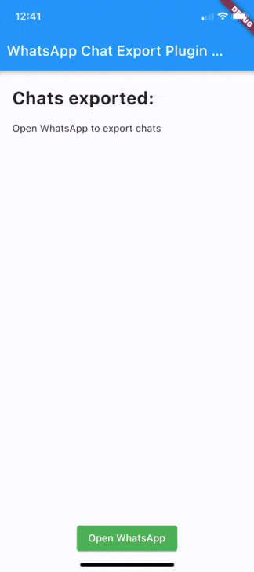
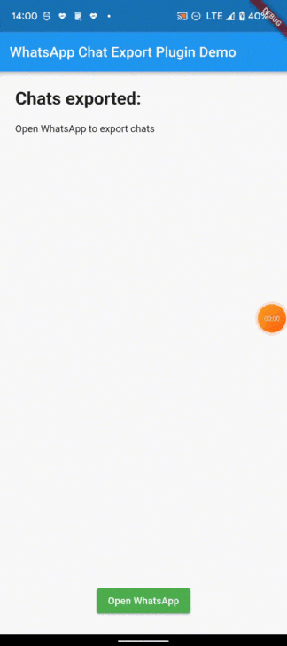

# Receive WhatsApp chat

A Flutter plugin that lets your app receive chats exported from WhatsApp
("Export chat" → your app), already parsed into members, messages and stats.

 

- [Installation](#installation)
- [Android setup](#android-setup)
- [iOS setup](#ios-setup)
- [Usage](#usage)
- [What you receive](#what-you-receive)
- [Example](#example)

# Installation

```yaml
dependencies:
  receive_whatsapp_chat: ^0.1.9
```

# Android setup

The plugin already registers the share intent filter. You only need to make
your `MainActivity` extend `FlutterShareReceiverActivity` instead of
`FlutterActivity`.

**Kotlin** — `android/app/src/main/kotlin/.../MainActivity.kt`

```kotlin
package <your.package.name> // from AndroidManifest.xml / build.gradle

import com.whatsapp.receive_whatsapp_chat.FlutterShareReceiverActivity

class MainActivity : FlutterShareReceiverActivity()
```

**Java** — `android/app/src/main/java/.../MainActivity.java`

```java
package <your.package.name>;

import com.whatsapp.receive_whatsapp_chat.FlutterShareReceiverActivity;

public class MainActivity extends FlutterShareReceiverActivity {
}
```

# iOS setup

On iOS, WhatsApp shares the chat through a Share Extension, handled by
[receive_sharing_intent](https://pub.dev/packages/receive_sharing_intent).
The [example app](example/ios) is a complete, working reference for every step
below.

In the steps below, replace `group.com.example.myapp` with your own App Group id
(usually `group.<your bundle identifier>`).

### 1. Create the Share Extension

1. Open `ios/Runner.xcworkspace` in Xcode.
2. **File → New → Target… → Share Extension**, name it `Share Extension`.
3. Set the extension's **Minimum Deployments** to the same iOS version as
   `Runner`.

### 2. Add an App Group to both targets

1. For **both** `Runner` and `Share Extension`: **Signing & Capabilities →
   + Capability → App Groups**, and add the same group, e.g.
   `group.com.example.myapp`.
2. For **both** targets: **Build Settings → + → Add User-Defined Setting**
   named `CUSTOM_GROUP_ID` with that same group id.

### 3. Runner `Info.plist`

`ios/Runner/Info.plist`

```xml
<key>AppGroupId</key>
<string>$(CUSTOM_GROUP_ID)</string>
<key>CFBundleURLTypes</key>
<array>
    <dict>
        <key>CFBundleTypeRole</key>
        <string>Editor</string>
        <key>CFBundleURLSchemes</key>
        <array>
            <string>ShareMedia-$(PRODUCT_BUNDLE_IDENTIFIER)</string>
        </array>
    </dict>
</array>
```

### 4. Share Extension `Info.plist`

`ios/Share Extension/Info.plist` — WhatsApp shares the chat as a zip file, so
the extension must accept files:

```xml
<key>AppGroupId</key>
<string>$(CUSTOM_GROUP_ID)</string>
<key>NSExtension</key>
<dict>
    <key>NSExtensionAttributes</key>
    <dict>
        <key>NSExtensionActivationRule</key>
        <dict>
            <key>NSExtensionActivationSupportsFileWithMaxCount</key>
            <integer>1</integer>
        </dict>
    </dict>
    <key>NSExtensionMainStoryboard</key>
    <string>MainInterface</string>
    <key>NSExtensionPointIdentifier</key>
    <string>com.apple.share-services</string>
</dict>
```

### 5. `ShareViewController.swift`

Replace the generated `ios/Share Extension/ShareViewController.swift` with:

```swift
import receive_sharing_intent

class ShareViewController: RSIShareViewController {
}
```

### 6. `Podfile`

Let the extension see the `receive_sharing_intent` pod:

```ruby
target 'Runner' do
  use_frameworks!

  flutter_install_all_ios_pods File.dirname(File.realpath(__FILE__))

  target 'Share Extension' do
    inherit! :search_paths
  end
end
```

Then run `cd ios && pod install`.

### 7. Build phase order

In the `Runner` target → **Build Phases**, drag **Embed Foundation Extensions**
(or **Embed App Extensions**) above **Thin Binary**. Otherwise Xcode fails with
a "Cycle inside Runner" build error.

# Usage

Make the `State` of your widget extend `ReceiveWhatsappChat` and implement
`receiveChatContent`. It is called with a parsed `ChatContent` each time a chat
is shared to your app:

```dart
import 'package:flutter/material.dart';
import 'package:receive_whatsapp_chat/receive_whatsapp_chat.dart';

class HomePage extends StatefulWidget {
  const HomePage({super.key});

  @override
  State<HomePage> createState() => _HomePageState();
}

class _HomePageState extends ReceiveWhatsappChat<HomePage> {
  final List<ChatContent> chats = [];

  @override
  void receiveChatContent(ChatContent chatContent) {
    setState(() => chats.add(chatContent));
  }

  @override
  void dispose() {
    disableShareReceiving();
    super.dispose();
  }

  @override
  Widget build(BuildContext context) {
    return Scaffold(
      body: ListView(
        children: [
          for (final chat in chats)
            ListTile(
              title: Text(chat.chatName),
              subtitle: Text('${chat.sizeOfChat} messages'),
            ),
        ],
      ),
    );
  }
}
```

Receiving starts automatically when the state is initialized. Call
`disableShareReceiving()` to stop and `enableShareReceiving()` to start again.

To try it, open a chat in WhatsApp → **More → Export chat → Without media**, and
pick your app.

> The parser supports several languages, but chats exported with WhatsApp set
> to English work best.

# What you receive

`ChatContent`

| Field              | Type                      | Description                              |
|--------------------|---------------------------|------------------------------------------|
| `chatName`         | `String`                  | Name of the chat                         |
| `members`          | `List<String>`            | Chat members                             |
| `messages`         | `List<MessageContent>`    | All messages, in order                   |
| `sizeOfChat`       | `int`                     | Number of messages                       |
| `msgsPerMember`    | `Map<String, int>`        | Message count per member                 |
| `indexesPerMember` | `Map<String, List<int>>`  | Indexes in `messages` for each member    |

`MessageContent`

| Field      | Type        | Description                 |
|------------|-------------|-----------------------------|
| `senderId` | `String?`   | Sender name / phone number  |
| `msg`      | `String?`   | Message text                |
| `dateTime` | `DateTime?` | When the message was sent   |

In debug builds the plugin logs failures to the console, prefixed with
`[receive_whatsapp_chat]`. Chat content is masked in these logs.

# Example

The [example](example) app receives chats on Android and iOS and shows chat
stats and messages. It also includes a sample chat, so you can try it without
WhatsApp.
